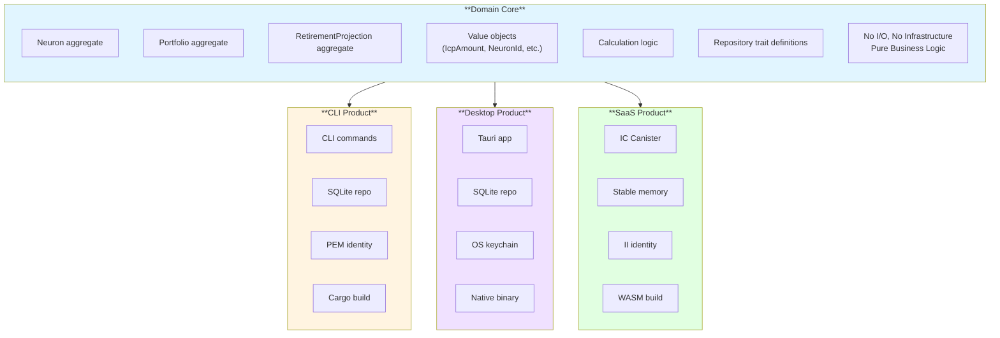
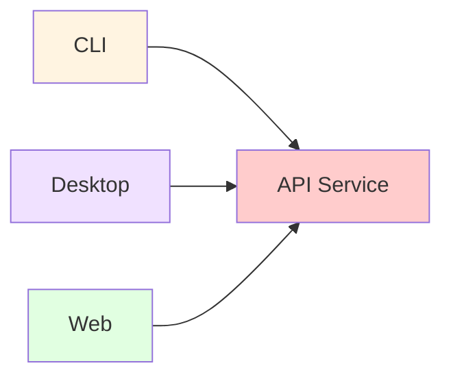

# ADR-003: Multi-Product Architecture with Shared Domain Core

**Status:** Accepted  
**Date:** 2025-10-26  
**Deciders:** U Reflection Design & Build Inc. Engineering Team  
**Related:** [ADR-002: Repository Pattern](002-repository-pattern.md)

---

## Context

ICP Neuron Tracker aims to serve three distinct user segments:

1. **Developers** - Need CLI tool for automation, scripting, CI/CD integration
2. **Privacy-Focused Users** - Want desktop application with local data storage
3. **Mass Market** - Prefer web-based SaaS with no installation

Each segment has different requirements:

| Requirement | CLI | Desktop | SaaS |
|------------|-----|---------|------|
| Installation | Command line | Download + install | None (browser) |
| Technical skill | High | Low | None |
| Data storage | Local SQLite | Local SQLite | Cloud (IC) |
| Identity | PEM file | OS keychain | Internet Identity |
| Updates | Manual | Automatic | Automatic |
| Offline mode | Yes | Yes | No |
| Platform | Cross-platform | Cross-platform | Any browser |

The challenge: How to serve all three segments without maintaining three separate codebases with duplicate business logic?

**Key insight:** All three products implement the same core functionality (neuron tracking, portfolio analytics, retirement projections). Only the delivery mechanism and storage differ.

---

## Decision

We will implement a **Hexagonal Architecture (Ports and Adapters)** with a shared domain core that compiles to multiple targets:

### Architecture Overview



### Core Principles

1. **Single Domain Core** - One source of truth for business logic
2. **Multiple Adapters** - Product-specific infrastructure implementations
3. **Compile-Time Polymorphism** - Same code compiles to different targets
4. **Dependency Inversion** - Domain defines interfaces, products implement them

### Repository Structure
```
icp-neuron-tracker/
├── Cargo.toml                              # Workspace root
├── crates/
│   ├── neuron-tracker-core/                # Domain core (shared)
│   │   ├── Cargo.toml
│   │   └── src/
│   │       ├── lib.rs
│   │       ├── domain/
│   │       │   ├── neuron.rs
│   │       │   ├── portfolio.rs
│   │       │   ├── retirement.rs
│   │       │   └── value_objects.rs
│   │       └── repositories/               # Trait definitions
│   │           └── mod.rs
│   │
│   ├── neuron-tracker-cli/                 # CLI product
│   │   ├── Cargo.toml
│   │   └── src/
│   │       ├── main.rs
│   │       ├── application/                # Application services
│   │       └── infrastructure/             # SQLite adapter
│   │
│   ├── neuron-tracker-desktop/             # Desktop product
│   │   ├── Cargo.toml
│   │   ├── src-tauri/                      # Rust backend
│   │   │   └── src/
│   │   │       ├── main.rs
│   │   │       └── infrastructure/         # SQLite + OS integration
│   │   └── src/                            # Web UI (React/Svelte)
│   │
│   └── neuron-tracker-canister/            # SaaS product
│       ├── Cargo.toml
│       └── src/
│           ├── lib.rs
│           └── infrastructure/             # Stable memory adapter
│
├── frontend-shared/                         # Shared UI components
└── docs/
```

### Domain Core Design

**Key characteristic:** No infrastructure dependencies
```toml
# crates/neuron-tracker-core/Cargo.toml
[package]
name = "neuron-tracker-core"
version = "0.1.0"
edition = "2021"

[lib]
crate-type = ["lib", "cdylib"]  # Native lib + WASM

[dependencies]
# ONLY pure Rust dependencies
serde = { version = "1.0", default-features = false, features = ["derive"] }
candid = { version = "0.10", default-features = false }

# NO tokio, rusqlite, ic-agent, or any I/O libraries!

[features]
default = ["std"]
std = ["serde/std"]
wasm = []
```

**Compiles to:**
- Native binary: `cargo build` (CLI, Desktop)
- WASM: `cargo build --target wasm32-unknown-unknown --no-default-features --features wasm` (IC Canister)

---

## Alternatives Considered

### Alternative 1: Monolithic Application

**Approach:** Single application with all features, users choose mode
```rust
fn main() {
    match args.mode {
        Mode::CLI => run_cli(),
        Mode::Desktop => run_desktop(),
        Mode::Web => run_web_server(),
    }
}
```

**Rejected because:**
- Desktop users forced to download web server code
- Cannot compile to WASM (async runtimes incompatible)
- Bloated binaries (100MB+ vs 5MB targeted)
- Complex conditional compilation
- Harder to maintain

### Alternative 2: Microservices

**Approach:** Shared REST API, different frontends



**Rejected because:**
- Requires running API server (defeats offline mode)
- Network dependency for local operations
- Privacy concerns (data leaves device)
- Latency overhead
- Complex deployment
- Against IC philosophy (canisters, not API servers)

### Alternative 3: Three Separate Codebases

**Approach:** Independent repositories for each product
```
icp-neuron-tracker-cli/
icp-neuron-tracker-desktop/
icp-neuron-tracker-web/
```

**Rejected because:**
- Business logic duplicated 3x
- Bug fixes need 3x work
- Feature parity difficult to maintain
- Testing burden multiplied
- Domain knowledge fragmented

### Alternative 4: Library + Applications

**Approach:** Publish core as library, applications depend on it

**Published crate**  
```
neuron-tracker-core (on crates.io)
```

**Separate applications**  
```
neuron-tracker-cli (depends on core)  
neuron-tracker-desktop (depends on core)  
neuron-tracker-web (depends on core)
```
**Rejected because:**
- Version coordination complexity
- Breaking changes affect