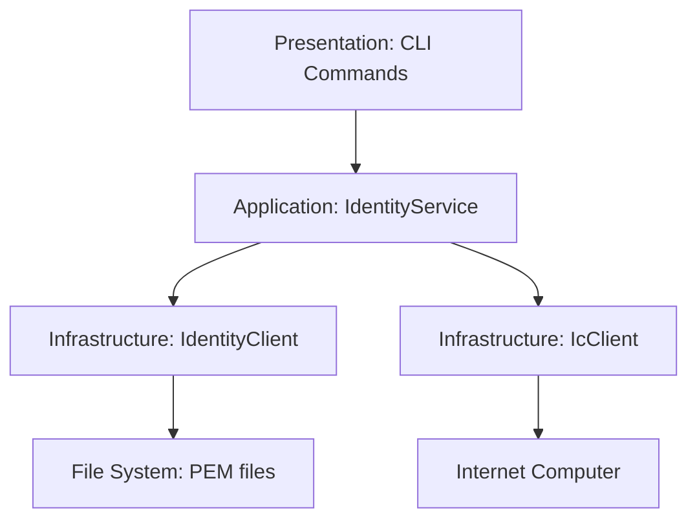

### Presentation Layer:

- Parse identity subcommands
- Format output for user
- Interactive prompts

### Application Layer:

- IdentityService - Orchestrate identity operations
- Validate identity against neurons
- Coordinate between components

### Infrastructure Layer:

- IdentityClient - Generate keypairs, write PEM files
- IcClient - Check neuron authorization (already exists)